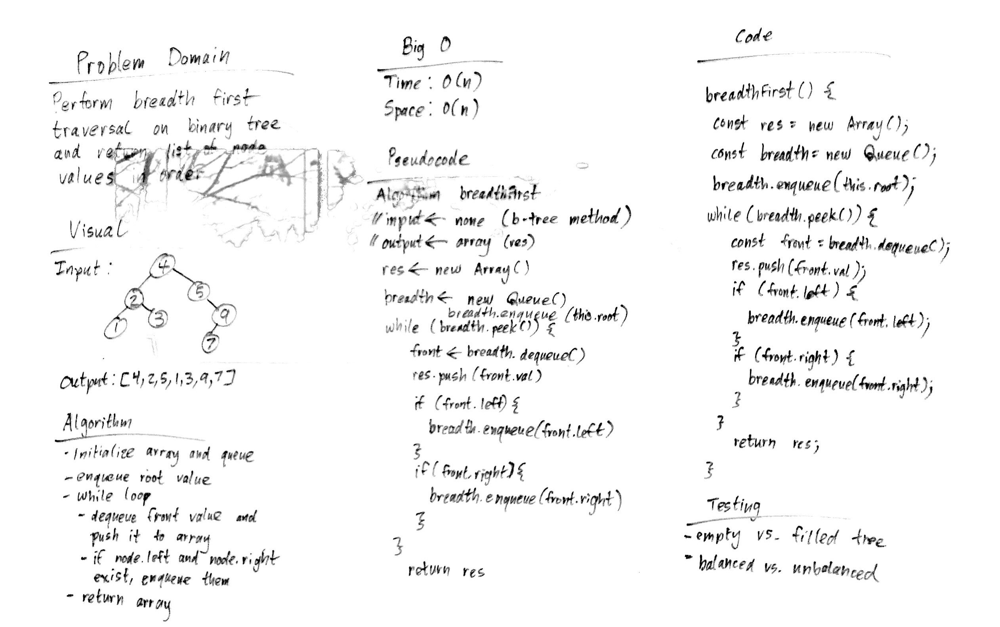

# Breadth-First Traversal

"Bread first" - Amanda Iverson

## Challenge

Write a breadth first traversal method which takes a Binary Tree as its unique input. Without utilizing any of the built-in methods available to your language, traverse the input tree using a Breadth-first approach, and return a list of the values in the tree in the order they were encountered.

Input:

Output: `[2,7,5,2,6,9,5,11,4]`

## Approach & Efficiency

### Algorithm

1. initialize an array to hold the output
2. initialize a queue to help with breadth first traversal
3. do while loop to perform traversal while queue has value
4. within loop. dequeue top value, add it to res, and then see if front.left and front.right exist
5. enqueue values that exist and go through loop again if needed
6. return array when done traversing

### Big O:

- Time: O(n)
- Space: O(n)

## Solution

