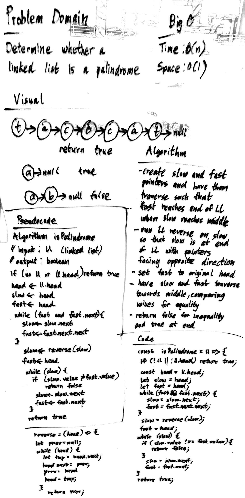

# Linked List Palindrome

Validate whether or not a Linked List is palindrome.

## Challenge

Write a function to validate whether or not a Linked list is palindrome
Example:

```
input: head->[t]->[a]->[c]->[o]->[c]->[a]->[t]
output: true

input: head->[m]->[o]->[o]->[m]
ouput: true

input: head->[h]->[o]->[u]->[s]->[e]
output: false
```

## Approach & Efficiency

### Algorithm

- create fast and slow pointers
- iterate until fast pointer is at the end and slow pointer is in the middle
- run a reverse function on the slow node so that the slow pointer is at the end of the list and ready to traverse
- set fast pointer to original head
- have slow and fast traverse towards the original LL's "middle", ensuring each value is the same
- return false if values end up being unequal within the loop
- return true if all values were the same

### Big O:

- Time: O(N)
- Space: O(1)

## Solution


